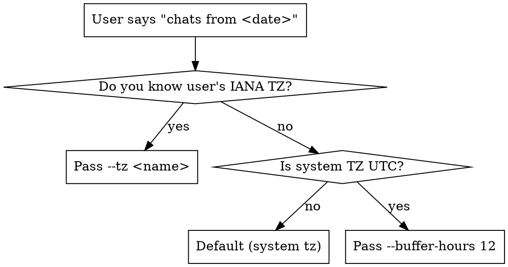

# Finding Old Chats

## Overview

Claude Code stores every session as a JSONL file under `~/.claude/projects/<dashed-cwd>/<uuid>.jsonl`. When the user asks for "chats from <date>", they mean their **wall-clock day**, not UTC — and the timestamps inside the JSONL are UTC. A naive `timestamp.startswith("YYYY-MM-DD")` filter silently drops sessions the user clearly considers part of that day.

This skill bundles a script (`scan_chats.py`) that does it right: convert local day → UTC window, then test each chat by interval-overlap, not substring match.

## The trap this skill exists to prevent

Real failure on 2026-05-07: user asked to review May 1 chats. The agent filtered with `startswith("2026-05-01")`, missed two sessions whose first timestamp was `2026-05-02T00:32Z` and `2026-05-02T00:43Z` — both are **May 1 evening in Central US time**, but every timestamp inside them starts with `2026-05-02`.

The mirror trap: a session whose first timestamp is `2026-05-01T03:55Z` is **April 30 evening local**, not a May 1 chat — but it would match the naive UTC filter.

Either way: do not use UTC-substring filtering. Use the script.

## Where transcripts live

`~/.claude/projects/<dashed-cwd>/<session-uuid>.jsonl`

Directory name is the absolute working-directory path with `/` → `-`, leading dash. Example:
- cwd: `/home/cs29824/matthew/icl-diversity`
- dir: `~/.claude/projects/-home-cs29824-matthew-icl-diversity/`

Each JSONL line is `{"type": "user"|"assistant"|"summary"|..., "timestamp": "2026-05-01T04:25:36.489Z", "message": {...}}`. Inside `message.content`, content can be a string or a list of `{type: text|tool_use|tool_result, ...}` parts.

## Quick reference

```bash
# Default: use system timezone
~/.claude/skills/finding-old-chats/scan_chats.py --date 2026-05-01

# System TZ is UTC but you think in local time — pass an IANA name
~/.claude/skills/finding-old-chats/scan_chats.py --date 2026-05-01 --tz America/Chicago

# Don't know the user's TZ — pad the window
~/.claude/skills/finding-old-chats/scan_chats.py --date 2026-05-01 --buffer-hours 12

# Different project
~/.claude/skills/finding-old-chats/scan_chats.py --date 2026-05-01 --project /path/to/project

# Show first user message + tail of each chat
~/.claude/skills/finding-old-chats/scan_chats.py --date 2026-05-01 --tz America/Chicago --full-msgs

# Just the chats whose last assistant turn looks like an unanswered question
~/.claude/skills/finding-old-chats/scan_chats.py --date 2026-05-01 --tz America/Chicago --unfinished-only
```

The script prints the UTC window it actually scans, so the caller can sanity-check the timezone.

## Picking the right time-window arguments



`--buffer-hours 12` casts a wider net (36-hour UTC window for one local day) and accepts some over-reporting in exchange for never missing a chat. Skim the printed UTC bounds and ignore obvious outliers.

## Detecting unfinished sessions

A chat is heuristically "probably unfinished" when:
- The last `assistant` message ends with `?` in its final 500 chars **or** ends with `]` (cut off mid-`tool_use`), AND
- No real user message follows. A "real" user message is **not** a `[tool_result...]` echo, a `<system-reminder>`, a `<command-name>` slash-command marker, a `<bash-input>/<bash-stdout>` echo, or a `<local-command-caveat>` echo.

`scan_chats.py --unfinished-only` flags these. Expect false positives:
- Rhetorical-question closers ("…or are we done here?", "Is this surprising?")
- Long sessions where the trailing `?` is hundreds of chars before genuine resolution

Always read the actual last messages before reporting "unfinished" to the user. The flag is a triage shortcut, not a verdict.

## Common mistakes

- ❌ `timestamp.startswith("YYYY-MM-DD")` — misses sessions that started after local-midnight-but-before-UTC-midnight.
- ❌ `find -newermt` on the JSONL files — uses file mtime, which moves whenever the IDE re-opens or re-writes them. Use timestamps **inside** the file.
- ❌ Treating system-reminders as the "first user message". The user's first real message is often several entries in. Use `is_real_user_msg` filtering.
- ❌ Reading 10 MB JSONLs with the `Read` tool — single-shot read can be near the file-size limit and is wasteful. The script streams line-by-line.
- ❌ Trusting the JSONL's last-message timestamp as "when the session ended". A session that started May 2 and was last touched May 7 may have been pending the entire week — first/last bracket the activity, the gap matters.
- ❌ Trying to compute "did this session end on action X" from the chat alone. Cross-check git log and current repo state for the work that was supposedly done.

## Implementation

See `scan_chats.py` in this directory. ~200 lines, stdlib only (`zoneinfo` from Python 3.9+).
